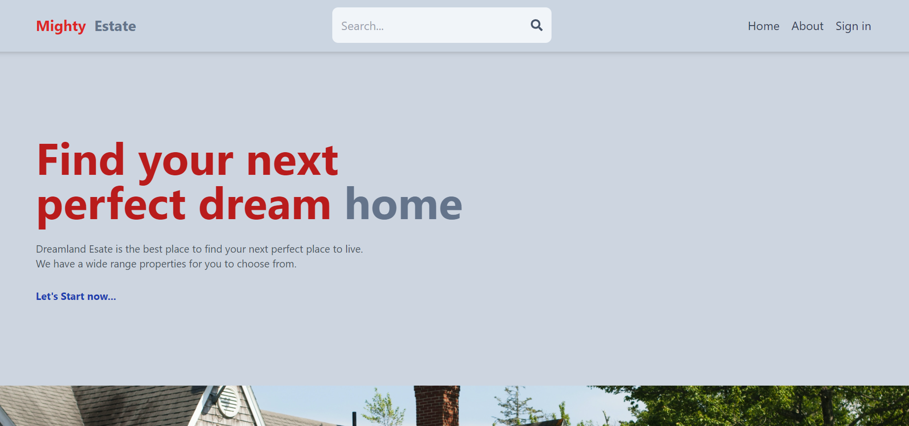
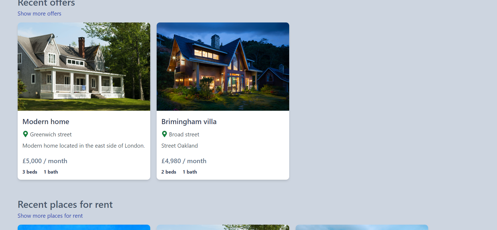
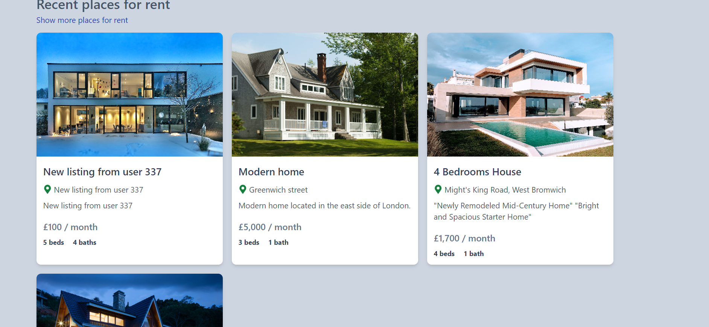
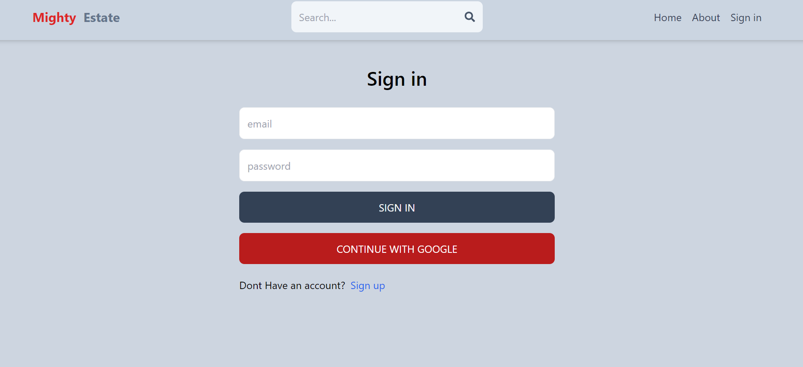
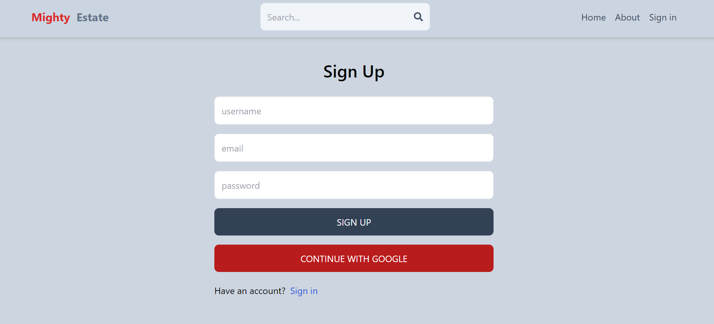

# MERN - Estate - Project

Welcome to the MERN Estate Project, a full-stack web application for managing real estate data. This project uses the MERN (MongoDB,
 Express.js,
 React.js,
 Node.js) 
stack, tailwind css and leverage Insomnia for testing API endpoints.

## About

The MERN Estate Project is a modern web application built using the MERN (MongoDB, Express.js, React.js, Node.js) stack. It serves as a comprehensive solution for managing real estate listings, providing a user-friendly interface for both property owners and potential buyers.

### Key Features

- **Dynamic Property Listings:** Easily add, update, and remove property listings with a dynamic and intuitive interface.

- **User Authentication:** Secure user authentication system allowing property owners to manage their listings and potential buyers to save favorites.

- **Responsive Design:** The application is designed to be responsive, ensuring a seamless experience across various devices.

### Technologies Used

- **MongoDB:** A NoSQL database for storing property data.
- **Express.js:** A web application framework for building the server-side of the application.
- **React.js:** A JavaScript library for building the user interface.
- **Node.js:** A runtime environment for executing server-side JavaScript.
- **Tailwind CSS:** A utility-first CSS framework for styling the application.

### Why MERN?

The MERN stack was chosen for its flexibility, scalability, and the ability to build real-time applications. It provides a robust foundation for creating a modern and efficient web application, ensuring a smooth user experience.

### Project Status

This project is currently in development, and contributions are welcome. Feel free to explore the codebase, open issues, and submit pull requests to help improve the project.

---

**Note:** Include any additional information or specific details about your project that you think would be helpful for users and contributors.

## Prerequisites

Before you begin, ensure you have the following installed:

- [Node.js](https://nodejs.org/)
- [MongoDB](https://www.mongodb.com/)
- [Insomnia](https://insomnia.rest/)

## Installation

# Clone the repository:
git clone https://github.com/Aneal07/MERN-Estate-Project.git

# Navigate to the project directory:
cd MERN-Estate-Project

# Install dependencies:
npm install

# Start the server:
npm run dev

# Running the Client:
# If you want to run the client as well, navigate to the client directory:
cd client

# Install client dependencies:
npm install

# Start the client:
npm run dev

